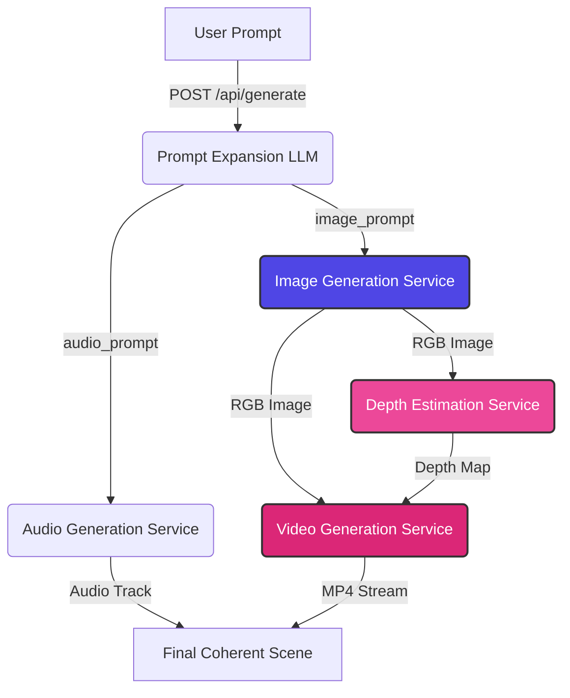

# Multiverse AI Studio

A portfolio-grade, full-stack generative AI application that chains five Hugging Face models into a unified, coherent multimedia pipeline. A single human prompt is expanded into specialized instructions to generate a **base visual scene**, estimate its **3D depth geometry**, synthesize an **ambient background soundscape**, and render a **cinematic video** anchoring the visual track.

Designed with a strict focus on system architecture, event-loop safety, memory management, and smooth user experience.

---

## 🏗️ System Architecture

### 1. Model Pipeline Flow
Every stage in the pipeline consumes something meaningful from the previous step. The visual assets (depth and video) are conditioned on the generated image, ensuring visual cohesion.



### 2. Event-Loop & Threading Execution Flow
ML model inference is CPU/GPU-bound and blocking. To prevent blocking FastAPI's main asynchronous event loop, all inferences are offloaded to a background thread pool.

```
Browser               FastAPI Route             Background Worker             Job Store
  │                         │                           │                         │
  │── POST /generate ──────>│                           │                         │
  │   (prompt payload)      │── Create Job (UUID) ───────────────────────────────>│ (QUEUED)
  │                         │── Schedule run_pipeline ──>│                        │
  │<── Return job_id ───────│                           │                         │
  │                         │                           │── Update Stage ────────>│ (EXPANDING...)
  │                         │                           │── Run Prompt LLM        │
  │                         │                           │── Run Image Gen         │
  │                         │                           │── Update Asset (img) ──>│ (Image URL)
  │                         │                           │── Run Depth Est         │
  │                         │                           │── Update Asset (depth) ─>│ (Depth URL)
  │                         │                           │── Run Audio/Video       │
  │                         │                           │── Update final state ──>│ (COMPLETED)
  │                         │                           │                         │
  │── GET /result/{id} ────>│────────────────────────────────────────────────────>│
  │<── Returns assets ──────│<────────────────────────────────────────────────────│
```

---

## ⚡ Key Features

* **Progressive Polling & Rendering**: The frontend polls `/api/result/{job_id}`. Completed assets (like the base image) are rendered on the screen *immediately* while downstream stages are still processing.
* **Granular Memory/VRAM Management**: Chaining 5 heavy models sequentially can cause VRAM Out-of-Memory (OOM) crashes. Each model wrapper implements a strict `cleanup()` method that deletes pipeline instances, runs garbage collection (`gc.collect()`), and flushes PyTorch's CUDA memory cache (`torch.cuda.empty_cache()`) before loading the next stage.
* **Stage Error Isolation**: Wrap-around try/except boundaries guarantee that a single failed stage (e.g., depth map or audio timeout) does not crash the entire pipeline. The server flags a `PARTIAL_FAILURE` and delivers all other successfully compiled assets.
* **Interactive CSS Depth Slider**: Features a custom swipable comparison slider built using CSS `clip-path` polygon slicing for smooth 60fps comparisons between the visual base image and its calculated depth map.
* **Custom Media Players**: Custom glassmorphic React components for audio and video playback, including a dynamic pulsing audio waveform visualizer.

---

## ⚙️ Project Setup

### Prerequisites
* Python 3.10+
* Node.js 18+
* Hugging Face Access Token (for gated model downloads and Inference API)

### 1. Environment Configuration
Create a `.env` file in the project root:
```env
HF_TOKEN=your_huggingface_access_token_here
MOCK_INFERENCE=False
FORCE_CPU_INFERENCE=False
```

#### Environment Variables Explained:
*   `HF_TOKEN`: Your Hugging Face user access token (required for querying the cloud image generation API and downloading gated local models).
*   `MOCK_INFERENCE`:
    *   `True` (Default DX): Bypasses all local and cloud model execution, returning mock visual, audio, and video assets in 1 second. Useful for testing UI components on any computer.
    *   `False` (Hybrid Production): Connects to the cloud and local machine learning models for real generation.
*   `FORCE_CPU_INFERENCE`:
    *   `False` (Safe Fallback): If running `MOCK_INFERENCE=False` on a **CPU-only machine**, the backend will run cloud image generation and local depth maps, but will automatically bypass the heavy `MusicGen` and `i2vgen-xl` local models to prevent RAM exhaustion.
    *   `True` (Force CPU): Forces the backend to download, load, and execute the full MusicGen and Video models locally on your CPU. *Warning: MusicGen takes 2–5 minutes, and i2vgen-xl takes 20–45 minutes on CPU.*

---

## 🚀 GPU & Production Execution Setup
If you want to run the **complete, real local PyTorch pipelines** (audio and video) on a GPU-enabled developer machine:

1.  **Install CUDA-enabled PyTorch**: Ensure your virtual environment is using a GPU-compiled version of PyTorch:
    ```bash
    pip install torch --index-url https://download.pytorch.org/whl/cu121
    ```
2.  **Configure environment**: Open your `.env` file and set:
    ```env
    HF_TOKEN=your_real_huggingface_token
    MOCK_INFERENCE=False
    FORCE_CPU_INFERENCE=False
    ```
3.  **Launch**: Run uvicorn. The backend will automatically detect the GPU (`cuda`), log the status, and run the real local Hugging Face and Diffusers pipelines at maximum speed.

### 2. Backend Installation
```bash
# Navigate to the backend directory
cd backend

# Create a virtual environment
python -m venv venv
source venv/bin/activate  # On Windows: venv\Scripts\activate

# Install dependencies
pip install -r requirements.txt

# Start the development server
python -m uvicorn main:app --host 127.0.0.1 --port 8000 --reload
```
The backend health check is available at `http://127.0.0.1:8000/api/health`.

### 3. Frontend Installation
```bash
# Navigate to the frontend directory
cd frontend

# Install packages
npm install

# Start the Vite React development server
npm run dev
```
Open `http://localhost:3000` to access the Multiverse AI Studio interface.

---

## 📈 Engineering Decisions & Tradeoffs

For a detailed analysis of our engineering decisions (such as choosing client polling over WebSockets, utilising an in-memory job store instead of Celery/Redis, and enforcing the BaseModel wrapper abstraction), please refer to the dedicated **[Tradeoffs and Decisions Report](file:///c:\AI Native founder\AI_Engineering\Projects\Multiverse_AI_Studio\docs\decisions\tradeoffs.md)**.

---

## 🚀 Future Roadmap

* **Server-Sent Events (SSE)**: Migrate the progressive rendering polling system to standard Server-Sent Events to push updates in real-time without client request overhead.
* **Persistent Database storage**: Replace the volatile in-memory dictionary with SQLite or PostgreSQL to keep user history across restarts.
* **Muxed Video Audio**: Integrate system FFmpeg binaries to merge (mux) the Stage 4 ambient soundscape directly into the Stage 5 MP4 video container.
